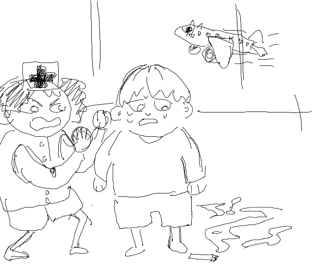

# Silvester am Flughafen

story number 5, storybook ids: 199-249

**Tabelle:**

| Deutsch                  | English Translation              | Русский (Russian)               | Beispielssatz                                  |
|--------------------------|---------------------------------|--------------------------------|------------------------------------------------|
| die Semmel               | the bread roll                  | булка                          | Ich kaufte eine **Semmel** vom Bäcker.          |
| das Inserat              | the advertisement               | объявление                     | Das **Inserat** war sehr ansprechend.           |
| ausziehen                | to move out/take off            | снимать                        | Ich muss meine Schuhe **ausziehen**.            |
| die Marille              | the apricot                     | абрикос                        | Ich liebe **Marille**-Marmelade.                |
| die Zahnbürste           | the toothbrush                  | зубная щётка                   | Meine **Zahnbürste** ist blau.                  |
| städtisch                | urban                           | городской                      | Das **städtische** Leben ist hektisch.          |
| wiegen                   | to weigh                        | весить                         | Wie viel **wiegen** Sie?                        |
| nirgends                 | nowhere                         | нигде                          | Ich kann mein Buch **nirgends** finden.         |
| das Rüebli               | the carrot (Swiss German)       | морковь                        | Mein Kaninchen liebt **Rüebli**.                |
| die Notaufnahme          | the emergency room              | отделение скорой помощи        | Er wurde in die **Notaufnahme** gebracht.       |
| wachsen                  | to grow                         | расти                          | Die Pflanzen **wachsen** schnell.               |
| voraus                   | ahead                           | впереди                        | Schau **voraus** und nicht zurück.              |
| entstehen                | to emerge, arise                | возникать                      | Aus einer Idee kann etwas Großes **entstehen**. |
| der Pilz                 | the mushroom                    | гриб                           | Ich mag **Pilz**-Suppe.                         |
| zusätzlich               | additionally                    | дополнительно                  | Ich habe **zusätzlich** ein Getränk bestellt.   |
| das Video                | the video                       | видео                          | Hast du das neue **Video** gesehen?              |
| versichern               | to insure                       | страховать                     | Ich muss mein Auto **versichern**.              |
| der Serviceangestellte   | the service employee            | служащий                       | Der **Serviceangestellte** war sehr freundlich. |
| das Plakat               | the poster                      | плакат                         | Das **Plakat** hängt an der Wand.               |
| die Ferien               | the holidays                    | каникулы                       | Die **Ferien** beginnen nächste Woche.          |
| innerhalb                | within                          | в течение                      | Das Paket kommt **innerhalb** von drei Tagen.   |
| zuletzt                  | lastly                          | в последний раз                | **Zuletzt** ging ich ins Kino.                  |
| Silvester                | New Year's Eve                  | Новый год                      | Wir feiern **Silvester** mit Feuerwerk.         |
| die Eltern               | the parents                     | родители                       | Meine **Eltern** sind sehr unterstützend.       |
| die Umleitung            | the diversion/detour            | объезд                         | Es gibt eine **Umleitung** wegen Bauarbeiten.   |
| zufällig                 | coincidentally, by chance       | случайно                       | Ich traf ihn **zufällig** im Park.               |
| der Fluss                | the river                       | река                           | Der **Fluss** fließt durch die Stadt.            |
| das Kraftfahrzeug        | the motor vehicle               | автомобиль                     | Mein **Kraftfahrzeug** ist sehr zuverlässig.    |
| die Einladung            | the invitation                  | приглашение                    | Ich habe eine **Einladung** zur Party bekommen. |
| steigen                  | to climb, rise                  | подниматься                    | Die Preise **steigen** ständig.                 |
| die Unterhaltung         | the conversation                | разговор                       | Die **Unterhaltung** war sehr interessant.      |
| die Verabredung          | the appointment, date           | встреча                        | Ich habe eine **Verabredung** um 5 Uhr.         |
| schreien                 | to scream, shout                | кричать                        | Warum **schreien** Sie?                         |
| der Zuschauer            | the spectator, viewer           | зритель                        | Viele **Zuschauer** kamen zum Spiel.            |
| die Gabel                | the fork                        | вилка                          | Kann ich eine **Gabel** haben?                  |
| tragen                   | to carry, wear                  | носить                         | Sie **trägt** ein rotes Kleid.                  |
| die Qualität             | the quality                     | качество                       | Die **Qualität** des Essens war hervorragend.   |
| das Bad                  | the bathroom, bath              | ванная                         | Ich werde ein heißes **Bad** nehmen.            |
| zählen                   | to count                        | считать                        | Kannst du bis zehn **zählen**?                  |
| der Leiter               | the ladder, leader              | лестница, руководитель         | Er ist der **Leiter** des Teams.                |
| woher                    | where from                      | откуда                         | **Woher** kommst du?                            |
| der Flughafen            | the airport                     | аэропорт                       | Mein Flug geht vom **Flughafen** Berlin.        |
| der Titel                | the title                       | заголовок, название            | Der **Titel** des Buches ist interessant.       |
| füttern                  | to feed                         | кормить                        | Ich muss die Katze **füttern**.                 |
| wahnsinnig               | insane, madly                   | безумно                        | Das ist **wahnsinnig** gut!                     |
| fördern                  | to promote, support             | способствовать                | Wir müssen Kunst **fördern**.                   |
| Abteilung                | department                      | отдел                          | Sie arbeitet in der Marketing-**Abteilung**.    |
| der Staub                | the dust                        | пыль                           | Es gibt viel **Staub** unter dem Bett.  |
| die Zigarette            | the cigarette                   | сигарета                       | Ich suche nach einer **Zigarette**.             |
| zusammenfassen           | to summarize                    | подводить итог                 | Kannst du das **zusammenfassen**?               |
| die Erde                 | the earth, soil                 | Земля, почва                   | Wir leben auf **der Erde**.                     |

Während **Silvester**, in einer **städtischen** Gegend, schaute ich aus dem Fenster und konnte **nirgends** einen **Fluss** finden. Anstatt zu feiern, hatte ich den Wunsch, zu reisen. Ich nahm **die Einladung** meiner **Eltern** an und beschloss, **innerhalb** der nächsten Tage zu ihnen zu fahren.

Am nächsten Morgen, zog ich meine Sachen **aus** und packte sie in mein **Kraftfahrzeug**. Als ich zum **Flughafen** fuhr, sah ich ein **Plakat** mit einem großen **Pilz** darauf und daneben ein **Inserat** für **die Semmel** und **die Marille** aus einem lokalen Bäckerladen.

Am Flughafen, gab es eine große **Umleitung**, und ich fand mich im falschen **Abteilung**. Ein **Serviceangestellte** kam zu Hilfe und gab mir **zusätzliche** Informationen. Während unserer **Unterhaltung**, schrie jemand „**Woher** hast du diese **Zahnbürste**?“ Ich schaute hinüber und sah eine Gruppe **Zuschauer** um ein **Video** herum, das ein Kind zeigte, das seine Katze mit einer **Gabel** **füttert**.

Ich dachte, das ist **wahnsinnig**. Ich entschied mich, meine Wartezeit zu **zählen**, indem ich ein Buch über die **Erde** las. Der **Titel** war „**Die Erde** und ihre Geheimnisse“. In dem Buch gab es eine **Verabredung** zwischen zwei Abenteurern, die in den Bergen **steigen** wollten.

Ich hörte plötzlich jemanden sagen, „**Zusammenfassen** bitte!“ und bemerkte, dass ich meine **Zigarette** auf dem Boden verloren hatte. Ein **Leiter** von einer **Notaufnahme**-Abteilung kam vorbei und riet mir, sicherer zu sein und mich zu **versichern**.

Als ich endlich ankam, begrüßten mich meine Eltern mit einer warmen **Umarmung**. Meine Mutter sagte, dass sie gerade eine **Rüebli**-Suppe gemacht hat und dass das **Bad** bereit ist, falls ich mich frisch machen möchte. Mein Vater fügte hinzu, dass **zuletzt** die **Qualität** des Wassers verbessert wurde, da sie ein neues Filtersystem installiert hatten.

Ich lachte und sagte, „Es ist **zufällig**, ich habe tatsächlich einen **Staub**-Filter für euch gekauft!“. Wir lachten und genossen unsere **Ferien** **zusammen**.
